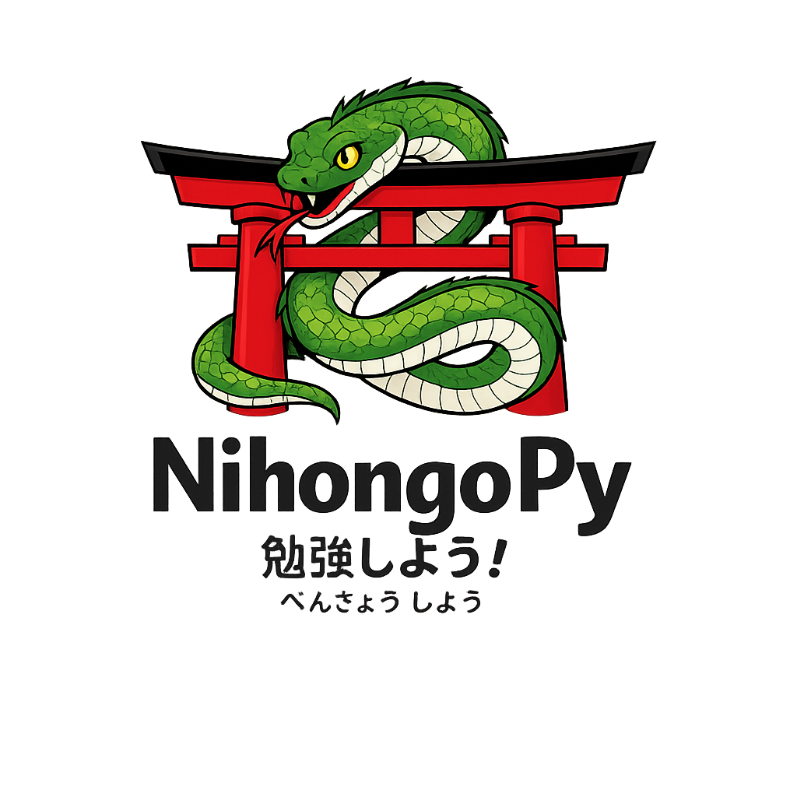

# NihongoPy

<p align="center">
  
</p>
[Ir al README en español](README_es.md)

NihongoPy is a small terminal app for practicing Japanese in a friendly way, without the classic "you made one mistake, now go sit in the corner" energy.

It is basically a free alternative to those language apps that love to interrupt your flow the second you fail something. Here, if you mess up, you still get feedback, a quick explanation, and then you can jump right back in and keep learning like a normal human being.

## What it does

- Practice `Hiragana`
- Practice `Katakana`
- Practice `Kanji`
- Practice `Grammar`
- Review kana tables and kanji lists
- Switch between English and Spanish
- Run entirely in the terminal

## Why this exists

Sometimes you do not want streak pressure.
Sometimes you do not want locked lessons.
Sometimes you just want to see Japanese characters, answer stuff, fail dramatically, learn something, and continue with your life.

This project is for that.

## Installation

1. Clone the repository:

```bash
git clone https://github.com/your-username/NihongoPy.git
cd NihongoPy
```

2. Create and activate a virtual environment:

```bash
python -m venv .venv
```

Windows:

```bash
.venv\Scripts\activate
```

macOS / Linux:

```bash
source .venv/bin/activate
```

3. Install the dependencies:

```bash
pip install -r requirements.txt
```

## Run

```bash
python main.py
```

## Dependencies

The project uses:

- `rich`
- `questionary`

They are already listed in `requirements.txt`.

## Project structure

- `main.py`: main terminal app
- `interface.json`: UI text in multiple languages
- `hiragana.json`: hiragana dataset
- `katakana.json`: katakana dataset
- `kanji.json`: kanji dataset
- `grammar.json`: grammar exercises

## Current vibe

- Free
- Terminal-based
- Slightly chaotic
- Surprisingly useful

## Contributing

If you want to improve the content, polish the UI, add more JLPT levels, or make the failure screen even more dramatic, contributions are welcome.

## License

Use it, learn with it, and make it better.
